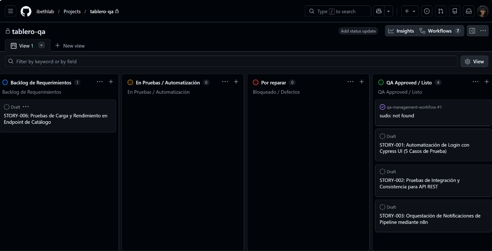

# QA Management Workflow 📋

Estrategia global de gestión de calidad, gobierno de pruebas de software y matriz de trazabilidad para el ecosistema e-commerce.

## 1. Plan de Testing (Estrategia General)
- **Objetivo:** Garantizar la estabilidad, seguridad y consistencia de las funcionalidades críticas de negocio (Autenticación, Gestión de Carrito de Compras y Verificación de API).
- **Alcance:** Pruebas funcionales de interfaz de usuario (E2E), validación de consistencia en capas de servicios (API REST) y auditoría de dependencias.
- **Criterios de Aceptación (Security Gate):** El pipeline de Jenkins requiere un 100% de éxito en los casos de prueba automáticos y cero (0) alertas críticas en el escaneo de seguridad (`npm audit`) para autorizar un despliegue seguro.

## 2. Tablero de Gestión (Kanban Board)
Monitoreo activo del ciclo de vida del testing y control de defectos mediante GitHub Projects:

## 3. Plantillas de Documentación (QA Templates)

### A. Estructura de un Test Case (Caso de Pruebas)
Cada funcionalidad se valida bajo la siguiente estructura lógica formal:
- **ID:** `TC-0XX`
- **Precondiciones:** Estado inicial del sistema y datos requeridos.
- **Pasos:** Acciones secuenciales ejecutadas por la suite de Cypress.
- **Resultado Esperado:** Estado final exitoso de la aplicación o respuesta HTTP 200 OK.

### B. Plantilla de Bug Report
Integrada de forma nativa en la sección de *Issues* para el control exhaustivo de fallos reportados en el entorno.

## 4. Matriz de Trazabilidad (Requisitos vs Tests)

| ID Requisito | Descripción del Requisito | Tipo de Pruebas | Caso de Prueba Asociado (Cypress) | Estado de QA |
| :--- | :--- | :--- | :--- | :---: |
| **REQ-001** | Autenticación segura de usuarios | UI E2E | `login_spec.cy.js` -> Login exitoso | ✅ Pasado |
| **REQ-002** | Persistencia en carrito de compras | UI E2E | `login_spec.cy.js` -> Agregar productos | ✅ Pasado |
| **REQ-003** | Gobierno de datos y respuestas API | API REST | `api_test.cy.js` -> Status 200 OK | ✅ Pasado |
| **REQ-004** | Mitigación de brechas de seguridad | DevSecOps | `Jenkinsfile` -> Stage: Security Scan | ✅ Pasado |

## 🚀 Enlaces de Ejecución Técnica
Los artefactos de código, el pipeline automatizado de 5 etapas y los scripts de ejecución headless para Cypress correspondientes a esta estrategia se encuentran en el repositorio de ingeniería: [Software Lifecycle Suite](https://github.com/ibethlab/software-lifecycle-suite).

---
*Este repositorio centraliza el gobierno de calidad y la documentación de control de calidad del proyecto estrella.*
